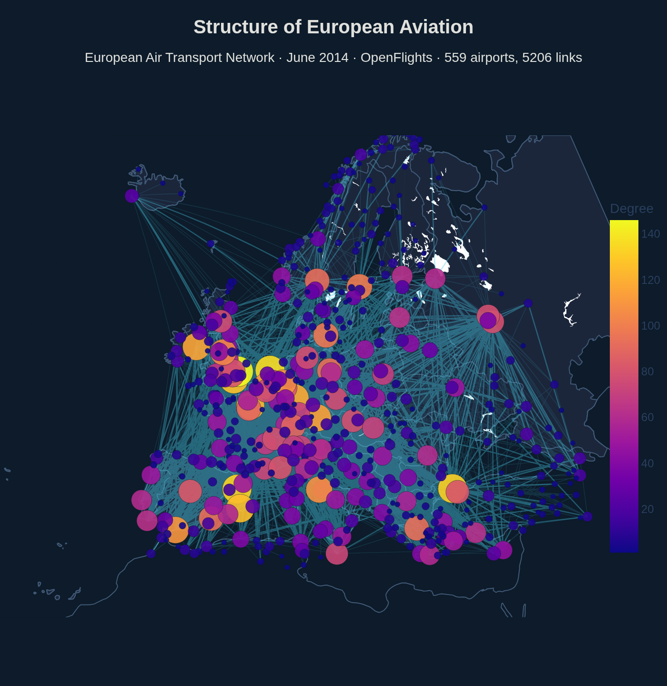
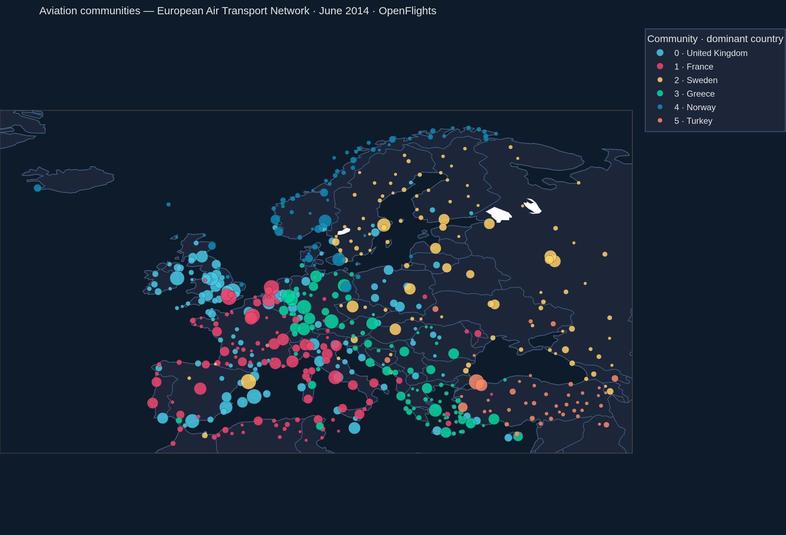
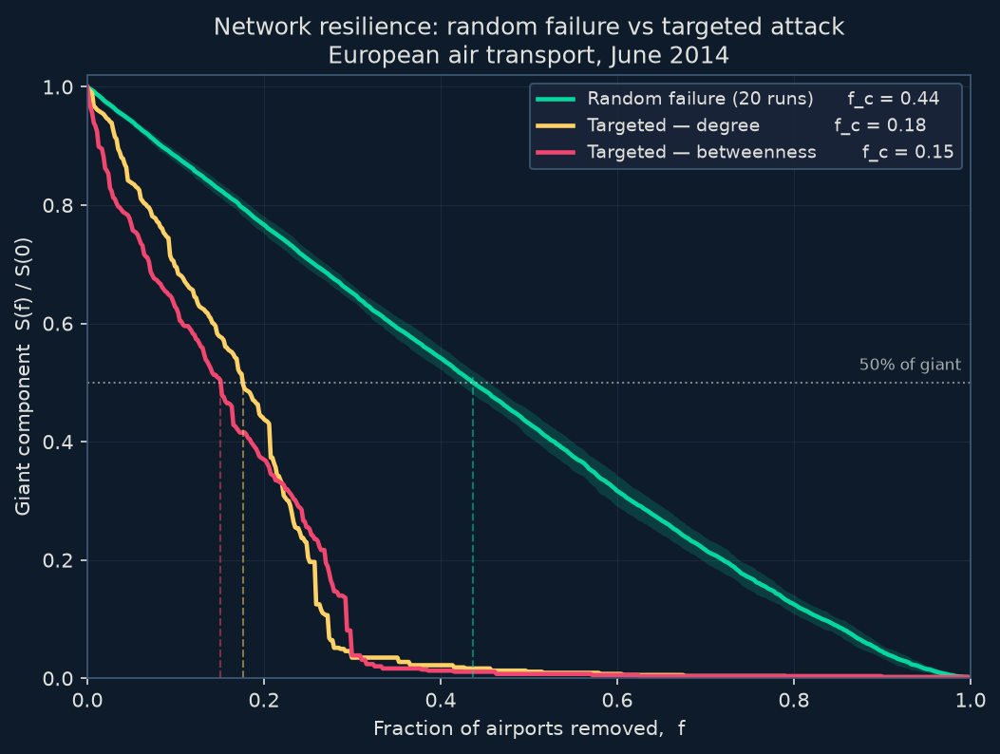

# Structure & Resilience of the European Air Transport Network

**Complex-systems analysis of European aviation — centrality, community detection, and network resilience.**

[](https://fatemeh-studio.github.io/eu-air-transport-network/)
[](LICENSE)
[](environment.yml)



> **European aviation (June 2014) is a _broad-scale_ network — resilient to random failure, but catastrophically fragile to a targeted attack on its structural hubs.**

Three questions, one per notebook: **which airports are structurally critical**, **do natural aviation communities follow country borders**, and **how does the network fail** under random failure versus targeted attack. Modelled as a directed, weighted graph of **559 airports** and **10,287 routes** (giant component **97.3%** of nodes), built from the OpenFlights route table.

> ⚠️ **Data vintage — June 2014.** Every figure and number here describes a frozen OpenFlights route snapshot, not today's network (OpenFlights' route feed stopped updating that month). The three questions are *topological* — degree distribution, community structure, percolation threshold — structural invariants that don't flip year to year, which is why a dated snapshot is fit for purpose and fully reproducible (12 MB tracked in git, no API key). See [`data/README.md`](data/README.md).

---

## At a glance

| | Directed graph | Undirected projection |
|---|---:|---:|
| Nodes (airports) | 559 | 559 |
| Edges (routes) | 10,287 | 5,206 |
| Giant component | 544 (97.3%) | 544 (97.3%) |
| Components | 5 | 5 |
| Density | 0.033 | 0.033 |

*Filtering trail: 16,780 raw EU–EU route rows → −2,762 codeshares → −1 multi-stop → 14,017 operating legs → 10,287 distinct directed edges.*

---

## Three findings

### 1 · Broad-scale, not scale-free — the finite-capacity ceiling

The degree distribution is heavy-tailed, but it is **not** a clean power law. A Clauset–Shalizi–Newman MLE fit (the `powerlaw` package, not OLS on a log-log plot) returns a tail slope **α = 1.59**, but the likelihood-ratio test **decisively rejects a pure power law** in favour of both a **log-normal** (R = −5.7) and a **truncated power law** (R = −7.0), each at *p* < 0.001. The honest label is therefore **broad-scale / truncated** — the signature of a finite-capacity ceiling on physical airport infrastructure (runways, slots and gates cap how large a hub can grow). The network is nonetheless strongly **small-world**: clustering C = 0.42 against a random C = 0.035, path length L = 2.71 — a small-world coefficient **σ = 10.9**.

### 2 · Communities are regional, not national

Weighted **Louvain** (resolution γ = 1.0, stable across 20 seeds) finds **6 communities at modularity Q = 0.293** — **2.4× the modularity of the by-country partition** (Q = 0.122). Half of all edges stay inside a community (**50.2%**) versus only a fifth inside a country (**19.7%**): the blocs are cross-border low-cost and charter markets, not flag-carrier fiefdoms. The two exceptions prove the rule — **Norway (71% single-country)** and **Turkey (78%)** are dense *domestic cores* that self-isolate.

### 3 · Robust yet fragile — Barabási (2000) on real infrastructure

Percolation under node removal splits sharply by strategy. The giant component halves at **f_c = 0.437 under random failure** but at just **0.151 under a targeted betweenness attack** — a **~2.9× robustness gap**, the textbook error-vs-attack asymmetry of a heavy-tailed network. And the **betweenness attack out-damages the degree attack** (f_c 0.151 vs 0.176): the **structural bridges matter more than the raw hubs**. Removing the top few betweenness nodes (IST, ARN, OSL, ATH, STN) shatters the map into ~285 fragments.

> **The Vienna question — an honest negative result.** The project set out to quantify Vienna (VIE) as *the* bridge between Eastern and Western Europe. Tested three ways with subset betweenness over East↔West shortest paths, VIE lands at **rank 40–45** — a solid **mid-tier hub, not the East–West bridge**. By June 2014 the low-cost carriers had already rewired Central/Eastern Europe to point-to-point (the top CEE gateways are LCC bases STN, BGY, LTN, DUB), and this project's codeshare filter deliberately hides Austrian's Star Alliance feed. **Structural centrality ≠ commercial importance** — the same lesson that reframed the resilience result. *(Dated caveat: VIE's position grew after 2018 as Wizz Air, Ryanair and Lauda built bases there — the 2014 finding is historical, not current.)*

---

## Methods

Airport and route tables are filtered to a European bounding box and **induced from route endpoints** into a directed, weighted `networkx` graph — edge weight = distinct *operating* carriers per pair, with codeshares and multi-leg services removed so a single physical flight isn't counted five times. Structure is characterised with six **centrality** measures, a **Clauset–Shalizi–Newman** power-law fit, and a **small-world** test against a seeded Erdős–Rényi ensemble; **Louvain** modularity maximisation extracts communities; and a **percolation** experiment removes nodes in random vs. degree- vs. betweenness-ranked order to locate the critical threshold *f_c* (Albert, Jeong & Barabási, *Nature* **406**, 2000). Nodes, edges and every computed centrality persist to **SQLite**, with the headline rankings expressed as saved, commented SQL queries.

---

## Gallery

**Route map** — airports sized by degree, routes shaded by operating-carrier count (the banner above; source `notebooks/01_graph_construction.ipynb`).

**Community structure** — 6 regional blocs from weighted Louvain:



**Resilience curve** — giant-component size as nodes are removed, random vs. targeted:



Full narrative, code and interactive network: **[the project website](https://fatemeh-studio.github.io/eu-air-transport-network/)**.

---

## Repository layout

```
eu-air-transport-network/
├── data/            OpenFlights airport + route tables (June 2014, tracked)
├── src/             build_graph.py · load_db.py · utils.py
├── sql/             schema.sql + one .sql file per named query
├── notebooks/       01 graph · 02 centrality · 03 communities · 04 resilience
├── figures/         PNG exports used in this README and the site
├── docs/            rendered Quarto website (served by GitHub Pages)
└── environment.yml  one-command reproducible conda env
```

---

## Reproduce

```bash
git clone https://github.com/fatemeh-studio/eu-air-transport-network.git
cd eu-air-transport-network
conda env create -f environment.yml
conda activate eu-air-network
```

Then build the database and run the notebooks in order:

```bash
python src/load_db.py     # builds network.db (nodes + edges); centralities filled by NB02/NB03
jupyter lab               # run 01 → 02 → 03 → 04
```

*(Optional — register the kernel for a global Jupyter: `python -m ipykernel install --user --name eu-air-network --display-name "EU Air Network"`.)*

---

## Tech stack

| Purpose | Tools |
|---|---|
| Graph construction & analysis | `networkx` |
| Community detection | `python-louvain` (Louvain modularity) |
| Degree-distribution fitting | `powerlaw` (Clauset–Shalizi–Newman) |
| Storage & SQL | SQLite (stdlib) + `pandas.read_sql` |
| Statistics | `scipy.stats`, `numpy`, `scikit-learn` |
| Figures & maps | `matplotlib`, `plotly` (+ `kaleido` for PNG export) |
| Interactive network | `pyvis` |
| Reporting | Quarto → GitHub Pages |

---

## Data attribution

Airport and route tables from **[OpenFlights](https://openflights.org/data.html)**, used under the OpenFlights [Open Database License](https://openflights.org/data.html). The route table is a **June 2014** snapshot — OpenFlights' route provider ceased updates then and flags the data "of historical value only." Full column schema and the complete filtering trail are documented in **[`data/README.md`](data/README.md)**.

Released under the [MIT License](LICENSE).
